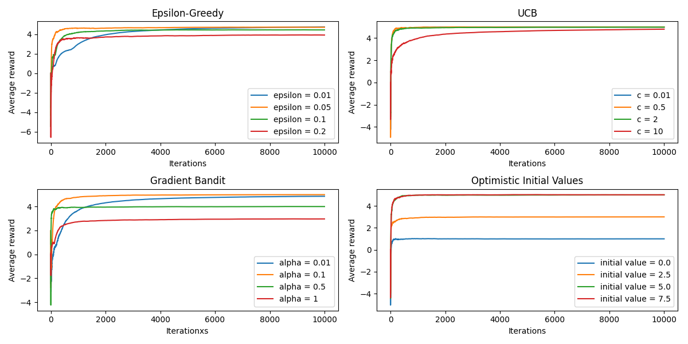
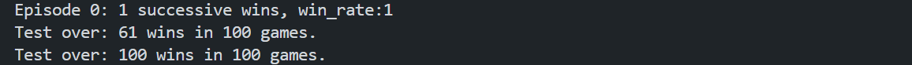

# 作业报告 (Week 1)

毛川 2300013218

## 多臂老虎机

分别实现了：$\epsilon$-greedy策略、UCB策略、Gradient Bandit策略，优化初值策略。代码见`多臂老虎机/bandit.py`。

### 实验结果：


### 结果分析：

- $\epsilon$-greedy策略：
  - 在实验中，$\epsilon=0.1/0.2$前期 reward 增长快，作为较大的$\epsilon$，前期更容易找到较优策略。但是 $\epsilon=0.2$ 在策略收敛时 average reward 最低，因为当所有的策略都确定了最优的 bandit 后，该策略仍然以一定的概率选择一个次优的 bandit。
  - 在该图中 $\epsilon=0.01$ 的策略在前期增长最慢，但是次优性这是由随机性导致的，$\epsilon=0.01$过于保守，探索不足，如果最初探索的老虎机是次优的，则很难跳出局部最优解。
  - 当执行足够多的迭代次数，且 bandit 的 reward 保持不变时，$\epsilon$-较小策略最终收敛时的 average reward 更大。
- UCB 策略：
  - $$ A_t = \arg\max_a \left[ Q_t(a) + c \sqrt{\frac{\ln t}{N_t(a)}} \right] $$
  - 当参数 c 较大时(c=10)，策略前期增长较慢，UCB 策略在前期增长较慢，因为该策略在前期会尝试所有的 bandit，探索性较强。
  - 但是当执行较多的迭代次数后，UCB 主要关注第一项，同时图中由于老虎机的数目少，不同参数的策略均找到了最优的 bandit。所以都有较高的 average reward。
- Gradient Bandit 策略：
  - $$ \pi_t(a) = \frac{e^{H_t(a)}}{\sum_b e^{H_t(b)}} $$
  - $$ H_{t+1}(A_t) = H_t(A_t) + \alpha (R_t - \bar{R_t})(1 - \pi_t(A_t)) $$
  - $$ H_{t+1}(a) = H_t(a) - \alpha (R_t - \bar{R_t})\pi_t(a), a \neq A_t $$
  - $\alpha$ 较大时，初期的 reward 增长快，因为每次探索到较优的 bandit 后，概率提升较大。反之同理。
  - 但是 $\alpha$ 较大时，收敛时策略的 average reward 较低，观察图中，$\alpha=1$ 并没有找到最优的 bandit，说明该策略过于激进，容易陷入局部最优解。
- 优化初值策略：
  - 该算法不同参数的随机性较大。当初值更加乐观时，策略会探索更多的 bandit，从而更可能在前期找到最优的 bandit。
  - 如果 init_value 较小，则策略会过早地收敛到一个次优的 bandit 上，导致 average reward 较低。

## tictactoe

实现了基于 **$\epsilon$-Greedy** 和**随机策略**两个的训练算法，执行多轮训练，每轮完成一局游戏，如果胜利 reward 为 1，失败为 -1，平局为 0。回溯更新储存的 Value function。

### 实现细节

- 转态编码：由于只有 9 个格子，每个格子有 3 种状态（空、X、O），所以可以用一个 18 位的二进制数来编码当前的状态。将每个 18 位的二进制数映射为一个 value.
- 棋局过程存储，由于要在己方决策时的每个 state 储存值函数，使用一个 stack 来储存一次 game 的所有 state.
- 由于 ``rand()`` 生成的随机数不够随机，使用 C++11 的 `<random>` 库来生成随机数。

### 实验结果

- 由于对手采取所有可行区域的第一个 action，策略非常固定，所以无论训练时己方使用 $\epsilon$-Greedy 还是随机策略，只要使用一次迭代更新 value function，训练出的模型就能完胜对手。
- 实验数据：

如果测试时使用随机策略，胜率会下降到 60% 左右。如果使用训练后的模型对战，则胜率能达到 100%。

```bash
Game reset.
Board: 
        _       _       _
        _       _       _
        _       _       _
Next turn: X

Game reset.
Board:
        _       _       _
        _       _       _
        _       _       _
Next turn: X

Game reset.
Board:
        _       _       _
        _       _       _
        _       _       _
Next turn: X

Action (0,0) taken.
Board:
        X       _       _
        _       _       _
        _       _       _
Next turn: O

Winner not found.

Action (0,1) taken.
Board:
        X       O       _
        _       _       _
        _       _       _
Next turn: X

Winner not found.

Action (0,2) taken.
Board:
        X       O       X
        _       _       _
        _       _       _
Next turn: O

Winner not found.

Action (1,0) taken.
Board:
        X       O       X
        O       _       _
        _       _       _
Next turn: X

Winner not found.

Action (1,1) taken.
Board:
        X       O       X
        O       X       _
        _       _       _
Next turn: O

Winner not found.

Action (1,2) taken.
Board:
        X       O       X
        O       X       O
        _       _       _
Next turn: X

Winner not found.

Action (2,0) taken.
Board:
        X       O       X
        O       X       O
        X       _       _
Next turn: O

Winner: X
```