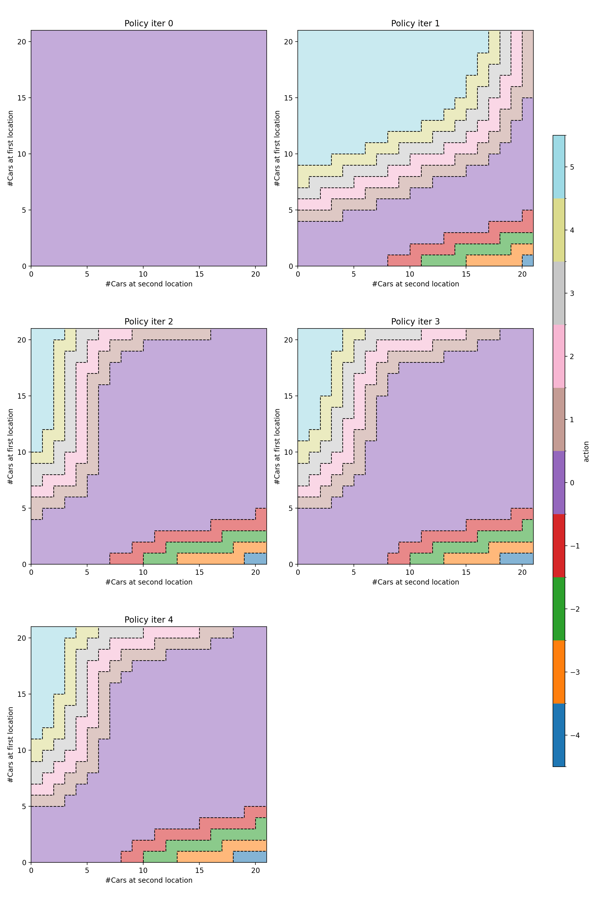
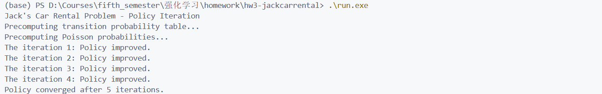
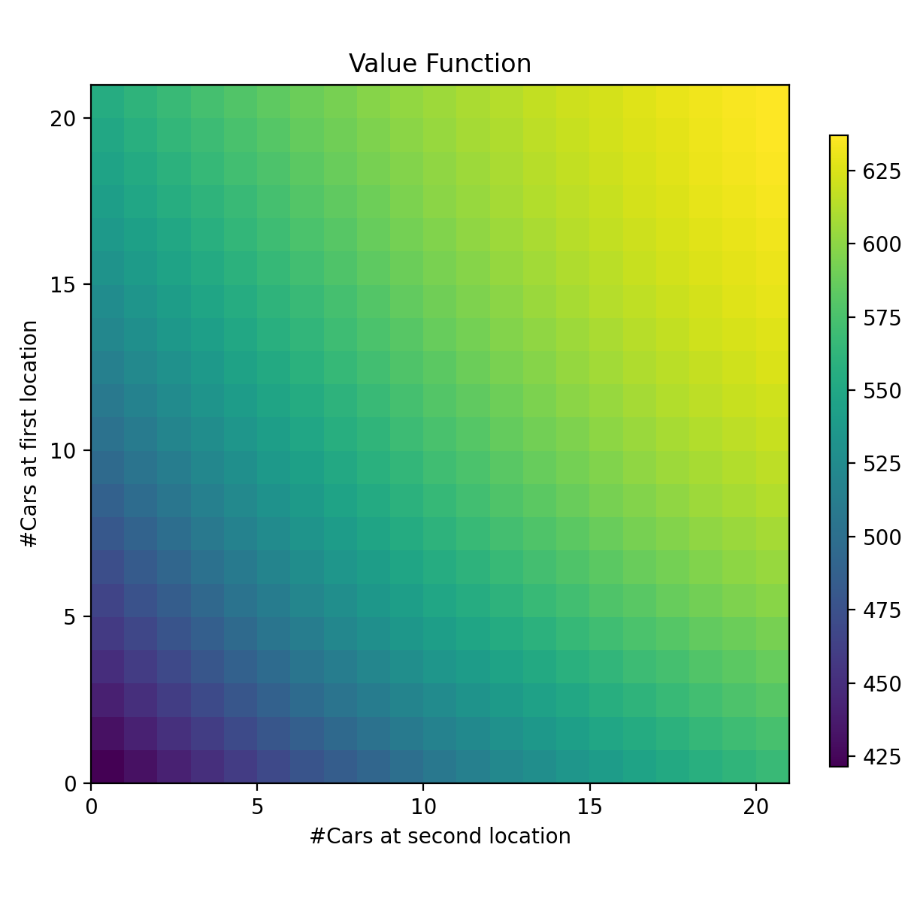

# 实验报告

毛川 2300013218

## Implementation of Jack's Car Rental

### 问题建模

state: (i,j) 表示一天结束时第一、二个停车场的车辆数
action: a表示从第一停车场向第二停车场调动的车辆数，a<0表示从第二停车场向第一停车场调动车辆.
reward: 一天的租车收益减去调动车辆的成本
$p(s'|s,a)$ 与 rent 和 return 的泊松分布有关

### Algorithm

#### policy iteration

$\pi \leftarrow$ 随机初始化
while True do:
    policy evaluation: $V \leftarrow$ 评估当前策略$\pi$, until convergence
    policy improvement: $\pi' \leftarrow$ 基于$V$的贪婪策略
    if $\pi' == \pi$ then, return $\pi, V$
    else: $\pi \leftarrow \pi'$

按“策略迭代次数”比较：策略迭代通常比价值迭代 更快收敛，因为每次改进都很彻底。

#### calculate transition probability

预先计算 $P(s'|s,a)$ 和 $R(s,a)$，避免在每次迭代中重复计算。
由于 poisson distribution 中 n 可以无限大，计算 tail probability 相对较复杂，枚举所有的 request，选取可行的最大值，计算 tail probability。return 同理。

#### visualization
将 C++ 计算的结果保存为 json 文件，使用 python 可视化。绘制每次迭代的策略的 heatmap。同时绘制最终稳定时的 value function 的 3D 图。

## Results

### Policy Iteration Process

By compiling and running ``run.exe``,get:

### Value Function

