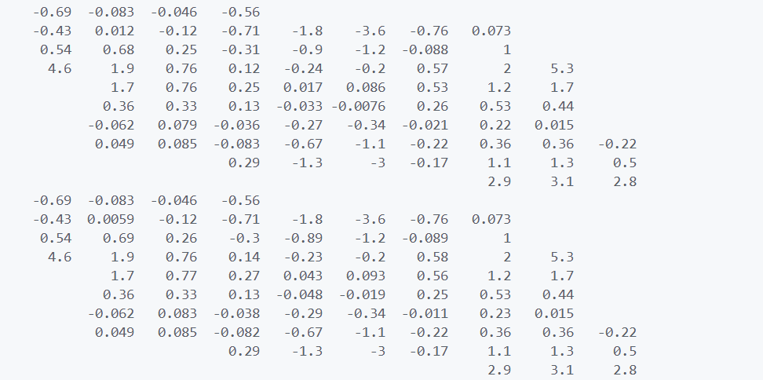
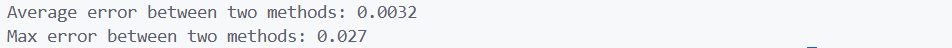
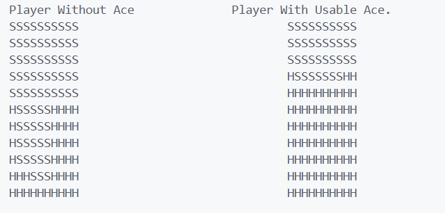
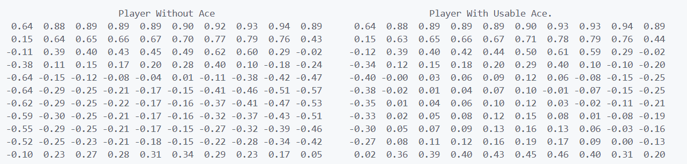

# HW 4 实验报告

毛川 2300013218

### Soap Bubble

**算法**：对于每一个点，使用 Monte Carlo 方法估计其高度。对一个点 (x,y)，从它开始随机探索 iter 个 episodes, 每个 episode 到边缘截止，return 为边缘的高度。最终的高度为所有 episode return 的平均值。

**结果**：
第一组数据是 DP 的结果，第二组是 Monte Carlo 的结果（迭代 100000 次）。

经过统计，平均误差和最大误差为：

### Black Jack

**算法**：使用 Monte Carlo 方法估计最优策略。对于每一个状态，随机模拟多次游戏，记录胜负情况，最终选择胜率最高的行动作为最优策略。为了不使策略由于过早收敛而无法探索更多的状态，使用 Explore Start 方法，即每次从一个随机状态并在第一步使用一个随机动作开始游戏，之后按照策略进行。这样可以保证 $\forall s, \forall a, P(s)>0,P(a|s)>0$。

**结果**：
经过 Monte Carlo 方法的统计(迭代 1000万次)，最终策略为下图，与课本上的结果一致。

值函数表为：

