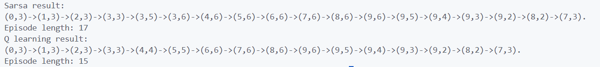

# 第五次作业实验报告

毛川 2300013218

## Windy Gridworld

### SARSA算法

代码解释:初始化状态 s，利用 $\epsilon$-greedy 策略选择动作 a，执行动作 a，观察奖励 r 和下一个状态 s'，再使用 $\epsilon$-greedy 策略选择下一个动作 a'，然后根据 SARSA 更新 Q 值。如果未终止，将 s' 和 a' 赋值给 s 和 a，继续循环，直到达到终止状态。
更新公式如下：
$$
Q(s, a) \leftarrow Q(s, a) + \alpha \left( r + \gamma Q(s', a') - Q(s, a) \right)
$$

### Q-Learning算法
代码解释:初始化状态 s，利用 $\epsilon$-greedy 策略选择动作 a，执行动作 a，观察奖励 r 和下一个状态 s'，然后在 s' 遍历所有可能的动作，得到最大的 Q' 值，根据 Q' 更新 Q 值。直到达到终止状态。

更新公式如下：
$$
Q(s, a) \leftarrow Q(s, a) + \alpha \left( r + \gamma \max_{a'} Q(s', a') - Q(s, a) \right)
$$

### 实验结果

编译运行代码，得到以下结果：由于采用了 $\epsilon$-greedy 策略，策略具有一定的随机性，因此每次运行结果会有所不同。以下是我多次运行后得到的平均结果曲线：两种算法的路径都小于 17 步，符合预期。

