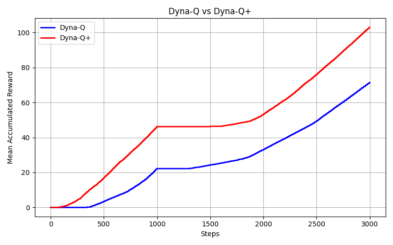
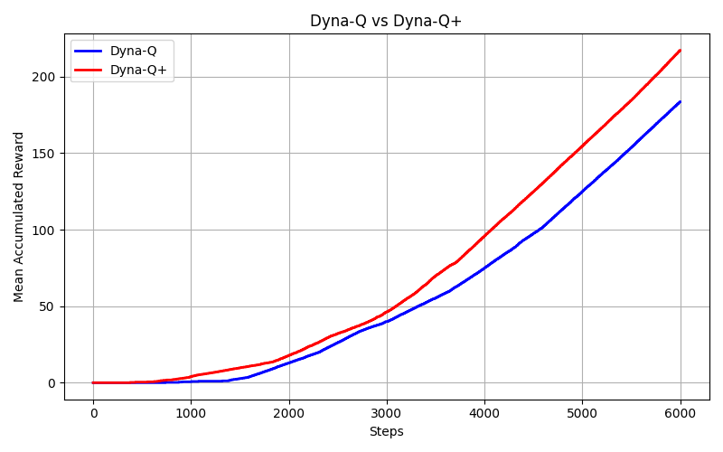

# 第六次作业实验报告

毛川 2300013218

### 内容实现

1. 理解Dyna-Q和Dyna-Q+算法的原理。比较两者在环境发生变化时的表现差异。
2. 在 Blocking Maze和 Shortcut Maze （环境变化积极）两种迷宫环境中，分别实现Dyna-Q和Dyna-Q+算法，并进行对比实验。
3. 通过调整超参数得到合理的实验结果。
4. 保存 csv 文件并绘制曲线图，展示不同算法在不同环境中的表现。

### 代码解释

使用 ``std::mt19937 rng(50); `` 作为随机数生成器，确保实验的可重复性。运行多轮取平均值，绘制曲线，减少偶然性影响。
由于环境时 deterministic 的，此处不需要额外学习一个 model(s,a)=s',r，直接使用真实环境进行规划。

算法实现逻辑：(Dyna-Q+ 部分)
```pseudocode
function learn(verbose = false, accumulated_array = null, run_number = 0)
    // 本地变量
    action, next_action : int
    reward : double
    current_env_p : pointer to MazeEnv = &env1
    state : MazeEnv.State
    step_result : MazeEnv.StepResult
    done : bool = false
    current_time : long = 0
    accumulated_reward : double = 0

    # 初始化 last_visited_time 为 -1（未访问）
    for x in 0 .. env1.max_x-1:
        for y in 0 .. env1.max_y-1:
            for a in 0 .. 3:
                idx = y * env1.max_x * 4 + x * 4 + a
                last_visited_time[idx] = -1

    if_changed : bool = false
    state = current_env_p.reset()
    step = -1

    while true:
        step = step + 1
        if step >= total_steps: # 按 step 进行，直到达到 total_steps
            break
        current_time = current_time + 1

        # 一回合结束
        if done:
            state = current_env_p.reset()
            done = false
            accumulated_reward = accumulated_reward + 1   # 完成一回合的额外奖励（原代码这样处理）


        accumulated_array[run_number * total_steps + step] = accumulated_reward

        # 切换环境（从 env1 到 env2）
        if step >= change_step and not if_changed:
            current_env_p = &env2
            state = current_env_p.reset()
            if_changed = true

        current_env_p.set_state(state)
        action = epsilon_greedy(state)

        # 更新记录：已见状态/动作 与 最后访问时间
        state_idx = state.y * env1.max_x + state.x    
        record_seen(state_idx, action)
        last_visited_time[locate(state, action)] = current_time

        # 与环境交互：执行动作，得到下一状态、奖励与 done 标志
        step_result = current_env_p.step(action)
        next_state = step_result.next_state
        reward = step_result.reward
        done = step_result.done

        # Q-learning 更新（基于真实观测）
        update_q(state, action, reward, next_state)
        state = next_state

        # Planning（Dyna）步骤：对先前观察到的状态-动作对做模拟更新
        for planning_step in 0 .. planning_n-1:
            sample = sample_state_action()    # 返回 (state_index, action)
            sampled_state = ( sample.first % env1.max_x, sample.first / env1.max_x )

            rand_action = sample.second
            current_env_p.set_state(sampled_state)

            # 使用环境模拟一步，获取 reward 与 next_state
            step_result = current_env_p.step(rand_action)

            # Dyna-Q+ 的奖励 
            elapsed = current_time - last_visited_time[locate(sampled_state, rand_action)]
            planning_reward = step_result.reward + kappa * sqrt(elapsed)
            planning_next_state = step_result.next_state
            # 用 planning_reward 更新 Q 值
            update_q(sampled_state, rand_action, planning_reward, planning_next_state)
        end for
    end while
end function
```

而 Dyna-Q 部分与上述伪代码类似，只是省略了 last_visited_time 相关逻辑，以及 planning_reward 直接等于 step_result.reward。


### 实验结果


在 Blocking Maze 中：



发现在该组超参数下，初始时 Dyna-Q+ 略优于 Dyna-Q。当环境改变时，两者在接近的时间步后找到了适应于新环境的策略，表现相似。Dyna-Q+虽然值较高，但是二者的**差距变化**并不显著。





但是在 Shortcut Maze 中：由于环境的变化是积极的，Dyna-Q+ 在探索时除了考虑即时奖励外，还会考虑长时间未访问的状态-动作对的潜在价值，因此在环境变化后，Dyna-Q+ 能更快地发现捷径，从而在表现上显著优于 Dyna-Q，即拉大累积奖励的差距。这验证了 Dyna-Q+ 在环境积极变化时的优势。
