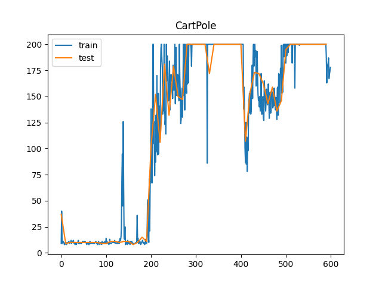
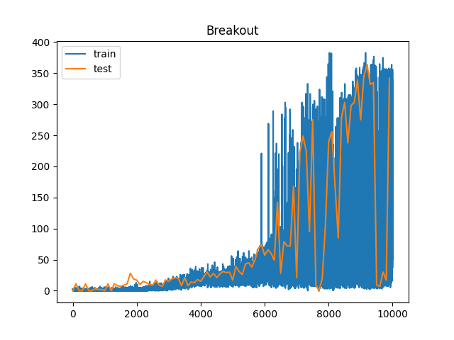

# 强化学习第八次作业报告 - DQN

毛川 2300013218

## CartPole (Continuous)


### DQN Algorithm
1. 在原有的 codebase 中已经实现了 replay buffer.
2. 实现 Target Network: 每执行 k 个 episode 通过复制主网络的参数到目标网络，定期更新目标网络以稳定训练.

### Tricks Implemented

Learning Rate Decay: 随着训练进行，逐渐降低学习率以提高收敛性.


### Network architecture


针对 CartPole 任务，我们使用一个轻量级的前馈神经网络。输入为  $ s_t \in \mathbb{R}^{\text{input\_dim}} $，依次经过以下两层全连接网络：

- **FC1：** 64 个隐藏单元，ReLU 激活  
- **FC2：** 输出层，维度为动作空间大小，用于预测各动作的 Q 值  

所有线性层使用 **正态初始化**，优化器为 Adam.


### Hyperparameters

```json
{
    "buffer_size": 2000,
    "batch_size": 64,
    "episodes": 600,
    "copy_steps": 500,
    "lr": 0.001,
    "epsilon": 0.05,
    "gamma": 0.98
}
```


### Experiment results

100%|█████████████████████████| 600/600 [05:54<00:00,  1.69it/s, lr=5.29e-5, reward=200, step=72246]

**曲线**：在如上的超参数下，实验结果的曲线为：




### Experiment Analysis


分析可知，在训练过程中，在 200 个 episode 后，模型的表现已经趋于稳定，平均 reward 达到 200，说明 DQN 能够有效地学习到 CartPole 的控制策略。也说明这个 task 相对简单，DQN 能够较快地收敛。


### Extended Experiments


由于实验成本较低，进行了其他超参数的尝试：

**降低 Target 更新频率**: 将同步频率体改为每 500 个 step 更新一次，结果发现训练更稳定，收敛速度更慢。

**降低 Buffer 大小**: 将 replay buffer 大小从 2000 降低到 800，收敛速度变快，因为前期不好的经验被更快地替换掉了。但是训练后期表现不稳定。


---

## Breakout


### DQN Algorithm
与 CartPole 相同，主要实现了 replay buffer 和 Target Network。但是超参数不同，同时引入了一些 Trick 以提升训练效果：


### Network architecture

本实验采用经典 **Nature DQN** 的卷积神经网络结构。输入状态为  $ s_t \in \mathbb{R}^{4 \times 84 \times 84} $，经过三层卷积神经网络提取空间特征：

- **Conv1：** 32 个卷积核，8×8 卷积核大小，步幅 4，激活函数 ReLU  
- **Conv2：** 64 个卷积核，4×4 卷积核大小，步幅 2，激活函数 ReLU  
- **Conv3：** 64 个卷积核，3×3 卷积核大小，步幅 1，激活函数 ReLU  

卷积模块输出展平（flatten）后，进入两层全连接网络：

- **FC1：** 512 个神经元，ReLU 激活  
- **FC2：** 输出层，维度等于动作空间大小（输出每个动作的 Q 值）  

最终网络输出对应状态 $ s_t $ 下所有可选动作的 Q 值 $ Q(s_t, a) $。


### Preprocessing


**高效处理 obs**: 由于图像为 (210,160,3)，直接输入网络计算量大且不必要。为了提高效率，采取以下预处理步骤：
1. 灰度化：将彩色图像转换为灰度图像，减少通道数。(210,160,1)
2. 裁剪：去除图像顶部和底部无关部分，只保留游戏区域。(160,160,1)
3. 缩放：将图像缩放到较小尺寸 (84,84,1)，以减少计算量。


**加入历史信息**: 为了让网络能够捕捉到动作的动态变化，通常会将连续的多帧图像堆叠作为网络的输入。例如，将最近的 4 帧图像堆叠，形成形状为 (84,84,4) 的输入。


**Manually Fire**: 为了加速训练过程，在每个 episode 开始时，手动执行 "FIRE" 动作以启动游戏，而不是等待游戏自动开始。在生命值减少时也执行 "FIRE" 动作以继续游戏。


**Epsilon-greedy Strategy and Decay Schedule**

为了在训练过程中实现从“探索”到“利用”的平稳过渡，我们采用分段线性衰减的 **epsilon-greedy** 策略。  
具体做法如下：模型以较高的探索率开始训练，并在之后分两阶段逐步降低 ε：

1. 初始保持阶段：在前 50,000 帧中，维持最大探索率 \( \epsilon = 1.0 \)。
2. 第一阶段线性衰减：在接下来的 1,000,000 帧中，将 ε 从 1.0 线性下降到 0.1。
3. 第二阶段线性衰减：随后的 1,500,000 帧中，继续将 ε 从 0.1 线性下降到最终的 0.01。
4. 稳定阶段：完成衰减后，ε 固定为最小值 0.01，保持稳定的利用行为。

该策略平衡了初期的充分探索和后期对最优策略的更强利用。


### Hyperparameters
```json
{
  "buffer_size": 50000,
  "batch_size": 32,
  "episodes": 5000,
  "copy_steps": 10000,
  "stack_size": 4,
  "lr": 5e-5,
  "gamma": 0.98
}
```


### Experiment results

**Scaling**: 在训练了 9000 个 episode 后，reward 才收敛，说明 DQN 对于复杂问题，大状态空间和较大的网络的学习需要较长时间。
训练总时长约 28 小时，执行约 5.1M 个 step。


35%|█████▎         | 3501/10000 [3:43:48<26:49:37, 14.86s/it, epsilon=0.307, loss=0.00145, reward=8, step=819827, step_p_epi=399]

100%|███████████████| 10000/10000 [27:59:44<00:00, 10.08s/it, epsilon=0.01, loss=0.015, reward=356, step=5176680, step_p_epi=1224]


**模型 return**: 最终模型在 Breakout 上的平均 return 达到 356，表现出色，说明 DQN 能够有效学习到游戏策略。




### Experiment Analysis

1. **训练时间长**: DQN 在复杂环境中需要大量的训练时间和数据才能收敛。可以考虑使用更高效的算法如 Double DQN 或 Dueling DQN 来提升学习效率。
2. **训练稳定性差**： DQN 训练过程中可能会出现不稳定现象，导致性能波动较大。发现常常会在后期出现前一个 episode 得分很高(350+)，后一个 episode 得分骤降(5-)的情况。分析：
    - 可能是由于 ε-greedy 策略在后期仍然允许一定概率的随机动作，导致偶尔选择了不利动作？但是在 test 阶段，使用完全贪婪策略，表现仍然不稳定。
    - 可能是模型训练崩溃了，从而影响决策？但是当模型的某个 episode 得分较低时，loss 并不大，说明 Q 值估计并没有出现严重偏差。
    - 综上分析：可能是 Breakout 游戏本身的随机性较大，有的情景较难，较好的 policy 也无法应对，从而影响模型的表现稳定性。例如有的小球弹射的速度太快，人类玩家有时也无法及时反应。
3. **可能的优化**：
    - 使用 Double DQN 加快收敛速度，减少过估计偏差。
    - 前期需要较快的 Target Network 更新频率，后期可以适当降低更新频率以稳定训练。