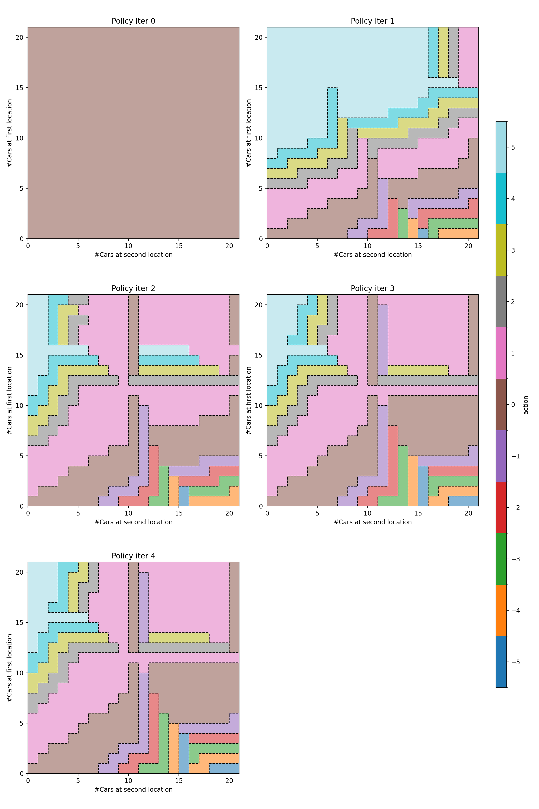
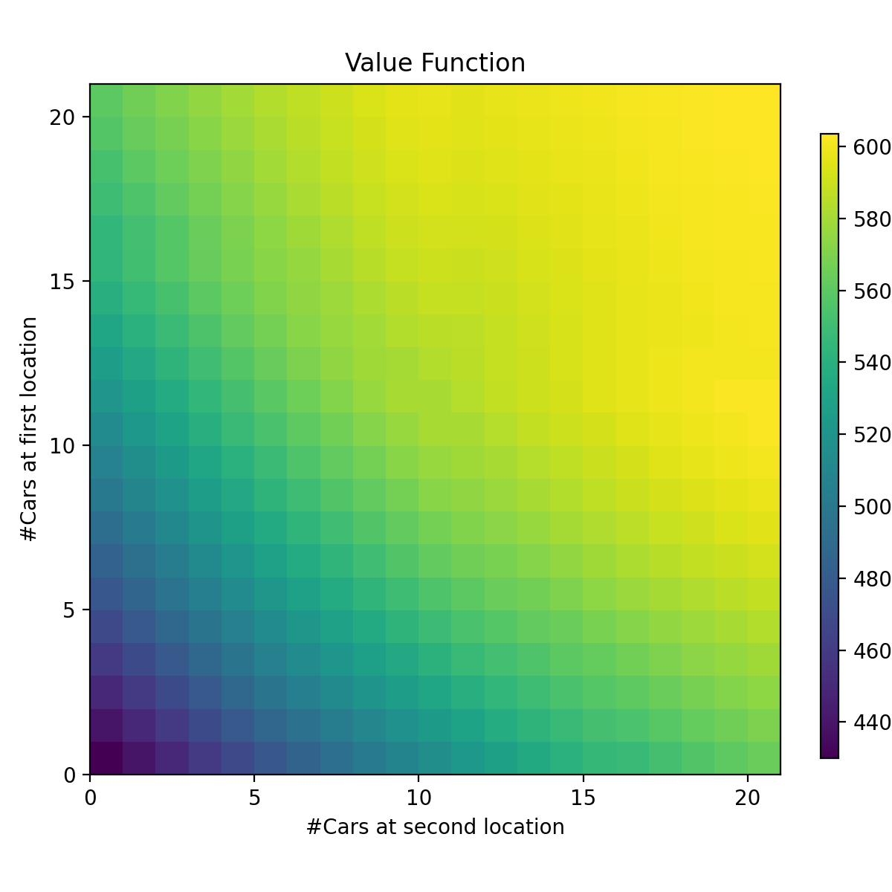

# 作业附加题实验报告

毛川 2300013218

## 代码解释

本实验直接在作业三的 Jack Car Rental 系统基础上进行扩展，根据题目要求修改了奖励函数。主要修改和新增的代码文件如下：

### parking_penalty

```c++
double parking_penalty = 0.0; // if the number of cars after moving is more than 10, pay another $4
if (early_next_cars_1 > 10) parking_penalty += 4.0;
if (early_next_cars_2 > 10) parking_penalty += 4.0;
```
如果某地当日停车数量超过 10 辆车，则需要额外支付 4 美元的停车费用。


### employee help to move car

```c++
double move_cost = 0.0;
if (action > 0) {
    // first car moved from 1->2 is free
    move_cost = 2.0 * std::max(0, action - 1); 
} else {
    move_cost = 2.0 * std::abs(action);
}
```
当从地点 1 向地点 2 移动车辆时，第一辆车是免费的，之后每辆车仍然需要支付 2 美元的移动费用。

于是在总的 return 计算中加入了上述两项修改：

```c++
double reward_for_this_request = (served1 + served2) * 10.0 - move_cost - parking_penalty;
```

<div style="page-break-before: always;"></div>

## 运行结果

通过策略迭代 5 次后，得到最终的最优策略和状态价值函数如下：



