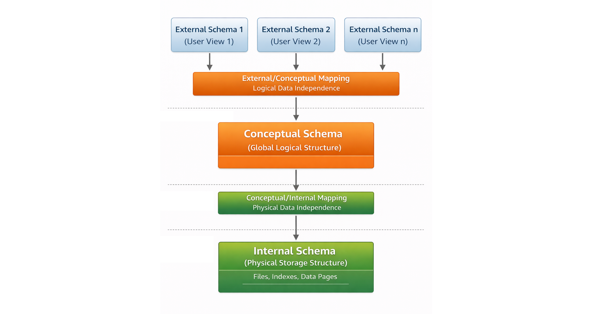
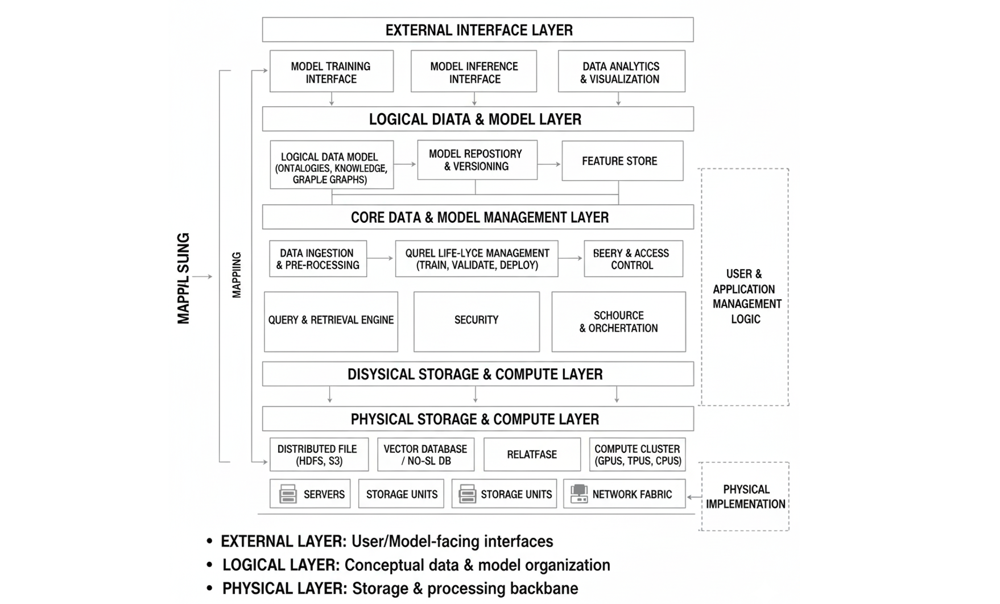

## 数据库概论作业

毛川 2300013218

### 1. 什么是数据独立性？它在数据管理技术发展历程中发挥怎样的作用？

数据独立性是指数据的存储方式或逻辑结构发生变化时，不需要修改应用程序，从而实现数据与程序的分离。

数据独立性包括：
- **物理数据独立性**：当数据的物理存储方式（如文件组织方式、索引等）改变时，应用程序无需修改。
- **逻辑数据独立性**：当数据库的逻辑结构（如增加属性、修改表结构等）改变时，应用程序无需修改。

**作用：**
- 降低应用程序与数据结构之间的耦合
- 提高系统的可维护性与可扩展性
- 支持数据共享与统一管理
- 是数据库系统相对于文件系统的重要优势之一

### 2. 数据库系统是从哪些方面来提高数据独立性的？

数据库系统主要通过以下机制提高数据独立性：

1. **三级模式结构**

   - 外模式（External Schema）：用户视图
   - 概念模式（Conceptual Schema）：数据库整体逻辑结构
   - 内模式（Internal Schema）：数据的物理存储结构

2. **两级映像机制**

   - 外模式 / 概念模式映像 → 保证逻辑数据独立性
   - 概念模式 / 内模式映像 → 保证物理数据独立性

3. **数据模型抽象**

   使用统一的数据模型（如关系模型）描述数据结构，使应用程序不依赖具体存储实现。

4. **数据字典与元数据管理**

   通过系统目录记录数据结构信息，实现集中管理与动态调整。

### 3. 比较数据库系统和文件系统在数据管理方面的不同，列出至少四个不同之处（可以做一个表格来展示）

| 对比方面 | 数据库系统 | 文件系统 |
|---|---|---|
| 数据组织 | 基于数据模型（如关系表） | 基于独立文件 |
| 数据冗余 | 冗余较少，可统一控制 | 冗余严重 |
| 数据独立性 | 高 | 低 |
| 数据共享 | 支持多用户共享 | 共享能力有限 |
| 并发控制 | 支持事务与并发控制 | 基本不支持 |
| 数据一致性 | 通过约束与事务保证 | 难以保证 |
| 安全管理 | 具有权限与安全机制 | 安全控制简单 |
| 查询能力 | 支持高级查询语言（SQL） | 需程序实现查询逻辑 |

### 4. 不适合使用数据库而应该基于文件系统的应用的特点有哪些？列举两个不适合使用数据库而应该基于文件系统的应用。

特点: 数据结构简单、数据关系较弱、数据量较小；单用户或顺序访问，不需要复杂查询或事务管理，对系统开销或性能要求较高。

示例:
1. **系统日志管理**
   - 如服务器日志、程序运行日志
   - 以顺序写入为主，通常使用文本文件存储

2. **多媒体文件存储**
   - 如图片、视频、音频文件
   - 数据体积大且结构简单，通常直接使用文件系统管理

### 5. 对不同模型（层次、网状、关系、面向对象模型）做一个表格来展示其模型结构、表达能力、数据独立性、操作简便性、适用场景等。

| 数据模型 | 模型结构 | 表达能力 | 数据独立性 | 操作简便性 | 适用场景 |
|---|---|---|---|---|---|
| 层次模型 | 树结构（父子关系） | 较弱 | 较低 | 操作复杂 | 层级结构数据 |
| 网状模型 | 图结构（多对多关系） | 较强 | 较低 | 操作复杂 | 复杂关联数据 |
| 关系模型 | 二维表结构 | 强 | 高 | 简单 | 各类信息管理系统 |
| 面向对象模型 | 对象及类结构 | 很强 | 较高 | 较复杂 | CAD、多媒体、复杂工程系统 |

### 6. 如果采用多维数组作为数据模型，它比较适合管理哪些应用场景的数据？（可以从数组的有序性和关系模型集合的无序性角度入手）

多维数组适合管理具有固定维度、天然顺序结构和规则网格结构的数据。

**原因：**

- 数组具有有序性：元素通过索引访问，位置具有明确语义。
- 关系模型是集合结构：元组之间无顺序，不适合表达位置或邻接关系。
- 多维数组能高效表达空间、时间或维度坐标关系。

**典型应用场景：**

- **图像数据**：二维像素矩阵 (height × width)
- **视频数据**：三维数组 (frame × height × width)
- **科学计算数据**：如气象数据 (time × latitude × longitude)
- **三维体素数据**：医学 CT / MRI 数据
- **深度学习张量数据**：如 (batch × channel × height × width)

这些数据天然具有 **规则结构和位置语义**，更适合数组模型而非关系模型。

### 7. 画出数据库三层模式架构图，简单说明一下模式分层的好处。

图片：

好处：
1. 数据独立性：逻辑数据独立性：概念模式的变化不会影响外部模式或应用程序；物理数据独立性：物理存储结构的改变不会影响概念模式
2. 多用户视图：不同用户或应用程序可以访问定制化的外部模式，使他们只能看到与任务相关的数据
3. 安全性：通过定义受限的外部模式来隐藏敏感数据，实现精细化的访问控制
4. 简化应用开发：应用程序与高层模式交互，无需处理底层存储细节，降低了程序设计的复杂度
5. 提升系统可维护性：存储结构或数据库设计的变更可在数据库管理系统内部处理，无需修改现有应用程序

### 8. 搜索引擎的关键字查询和数据库查询有何不同？试从查询方式和查询结果来比较。

| 对比方面 | 搜索引擎查询 | 数据库查询 |
|---|---|---|
| 查询方式 | 关键字匹配 | 结构化查询语言（如 SQL） |
| 数据结构 | 非结构化或半结构化数据 | 结构化数据 |
| 查询条件 | 模糊匹配 | 精确条件 |
| 查询语义 | 相关性检索 | 逻辑条件过滤 |
| 查询结果 | 按相关性排序的文档集合 | 满足条件的精确数据集合 |
| 结果确定性 | 不完全确定 | 确定且可重复 |

### 9. DBMS 的主要数据控制功能应该有哪些？如果有一个淘宝达人想基于单机版数据库比如 Access 记录自己的购物流水，上面的哪些功能是他所不需要的？

DBMS 的主要数据控制功能:
1. **安全控制（Security Control）**：保护数据以防止不合法的使用所造成的数据泄露和破坏
2. **完整性控制（Integrity Control）**：数据的正确性、有效性、相容性
3. **并发控制（Concurrency Control）**：多用户同时访问数据时保证一致性
4. **恢复性控制（Recovery Control）**：系统崩溃后恢复数据库

单机版 Access 记录购物流水时不需要的功能 *并发控制* 和 *安全性控制* （只有单用户）

### 10. DBA 应该履行哪些职能？相应的他又应该具备哪些技能？

DBA（Database Administrator）的主要职能:

1. **数据库设计与规划**
   - 概念模型与结构模型设计
   - 数据模式设计

2. **数据库安装与配置**
   - DBMS 部署
   - 参数配置

3. **数据库安全管理**
   - 用户管理
   - 权限控制

4. **数据库运行维护**
   - 性能监控
   - 资源管理

5. **备份与恢复管理**
   - 制定备份策略
   - 数据恢复

6. **性能优化**
   - 索引优化
   - 查询优化
   - 存储优化

DBA 需要具备的技能:

1. **数据库技术**
- SQL 与数据库语言
- 数据库设计理论
- 索引与查询优化
2. **系统技术**
- 操作系统（Linux / Windows）
- 存储系统
- 网络基础
3. **管理与运维能力**
- 备份与恢复策略
- 性能监控与调优
- 故障排查

### 12. 借鉴 DBMS 分层结构，启发大模型为你画出一张面向大模型的数据管理系统的架构图。

图片：

