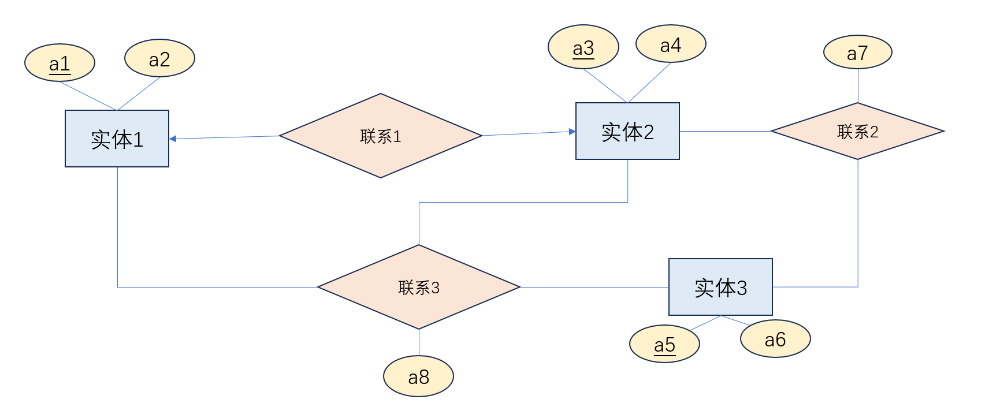
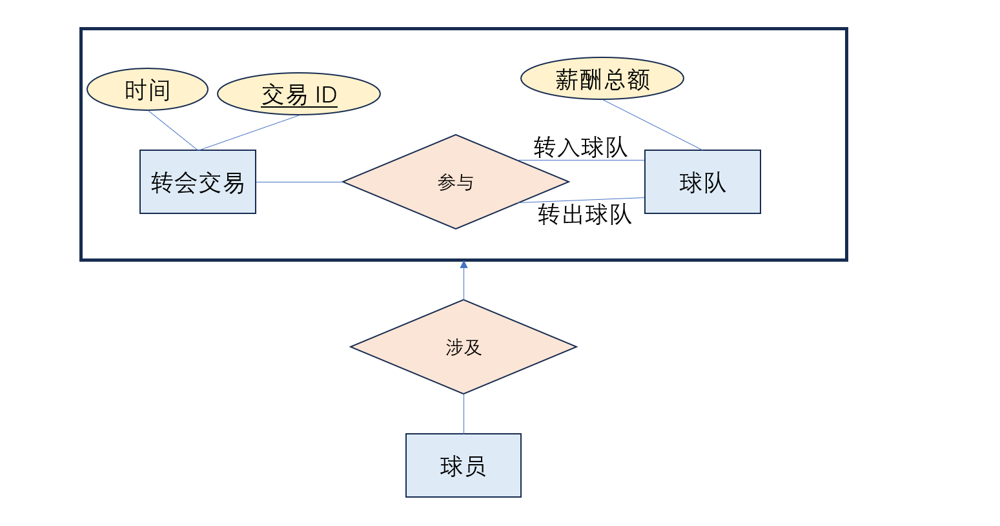
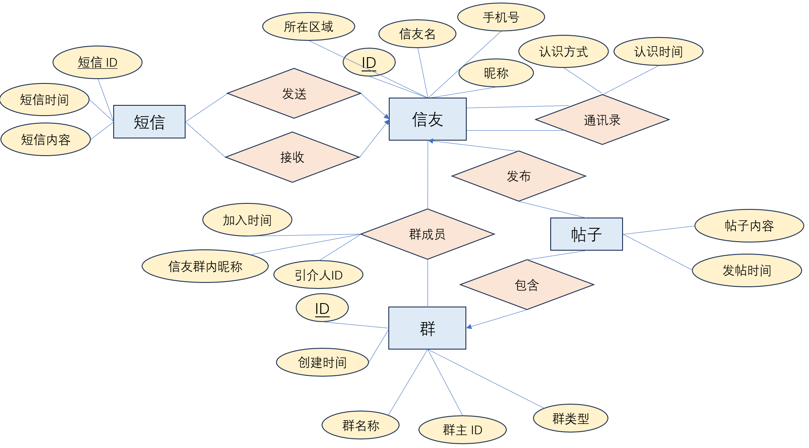
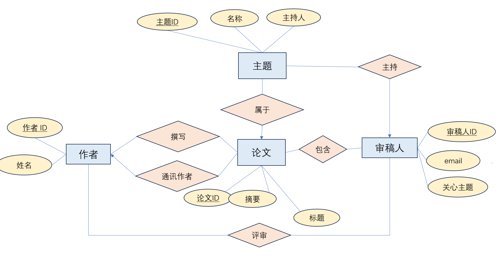
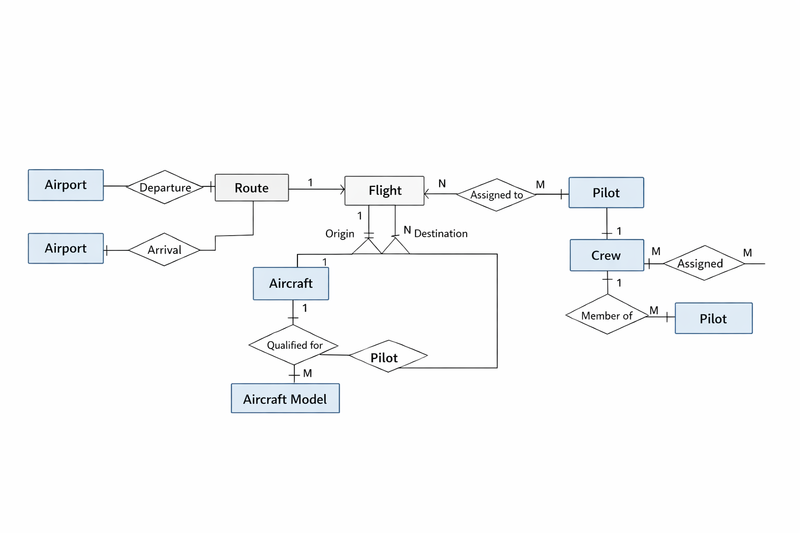

## 数据库概论第二次作业

毛川 2300013218

## Q1：更多例子

一、 弱实体

代码托管平台（如 GitHub / GitLab）中的“代码仓库”与“Issue（工单/问题）”
>在 GitHub 中，“代码仓库 (Repository)” 是一个**强实体**，拥有全局唯一的全站 ID（或者全局唯一的 `用户名/仓库名`）。而“Issue”是一个**弱实体**。
当我们说“Issue #12”时，这个数字 `12` 只是一个**部分码**。它在全网中并不唯一（数以千万计的仓库都有自己的 Issue #12），它只有依附于特定的“代码仓库”时（例如 `torvalds/linux 的 Issue #12`），才能被唯一标识。
如果不使用弱实体，我们就得给 Issue 强行分配一个毫无规律的全局 UUID 作为主码暴露给用户。使用弱实体和部分码，可以让不同仓库内部的 Issue 编号都从 `#1` 开始独立递增，这完全符合开发者的日常使用习惯。

二、 聚集

互联网医疗平台中的“问诊”与“处方/评价”
> 平台上有“医生 (Doctor)”和“患者 (Patient)”两个实体。医生和患者之间存在一个多对多 (M:N) 的联系，称为**“问诊 (Consultation)”**（包含问诊时间、症状描述等属性）。
现在业务引入了“电子处方”实体和“患者评价”实体。处方和评价并不是单纯开给医生的，也不是单纯开给患者的，而是针对某一次特定的问诊过程开具的。**
此时，我们将“医生”与“患者”的“问诊”联系通过一个框括起来，形成一个**聚集**，将其当作一个高阶实体来看待。然后，让“处方”和“评价”实体去与这个“问诊聚集”建立联系。
如果不使用聚集，开发者可能会被迫画一个“医生-患者-处方”的三元联系，甚至“医生-患者-处方-评价”的四元联系。这不仅在逻辑上混淆了“问诊行为”和“开药行为”的先后次序，还极其难以维护。

三、 细化/泛化

现代 App 的“统一消息推送系统 (Notification System)”
> App 需要向用户发送各种通知，我们建立一个**泛化实体**叫做“消息通知 (Notification)”，它包含所有通知共有的属性（如：`通知流水号`、`接收用户ID`、`触发时间`、`消息正文`）。
然后我们将它**细化（子类）**为三种具体的实体：
**短信通知 (SMS)**：拥有特有属性 `手机号`、`运营商通道代码`、`短信计费条数`。
**邮件通知 (Email)**：拥有特有属性 `收件人邮箱`、`邮件主题(Subject)`、`抄送人(CC)`、`SMTP状态码`。
**App内推 (Push)**：拥有特有属性 `设备Token`、`App包名`、`角标数字(Badge)`。
如果不采用泛化结构而把所有属性塞进一张“大宽表”里，当发送一条“短信”时，有关邮件和App推送的字段全都是 NULL，这不仅浪费存储空间，还容易引起程序的空指针异常或索引失效。细化允许我们只记录必要的专用属性。

## Q2：关系模式 to E-R 图

## Q3：表格数据 to E-R 图

## Q4：微信朋友圈的 E-R 图

## Q5：论文审稿的 E-R 图

## Q6: Airport E-R 图

**航班、航线、机场、机组、飞机、飞行员之间的业务关系:**
机场—航线（出发/到达）
航线—航班（1:N）
机场—航班（起飞/到达）
飞机—航班（1:N）
飞行员—航班（M:N）
飞行员—飞机型号（M:N）
航班—机组（1:1）
机组—飞行员（M:N）

如下图所示：

## Q7: Bilibili 实例分析

B 站比较典型的**功能模块**：以用户账号与内容社区为基础，围绕视频投稿与观看、弹幕评论互动、创作者后台运营、直播与虚拟消费、大会员和付费内容、广告商业化、游戏发行，以及会员购/票务/漫画等衍生内容服务所构成的综合平台体系；其中从公司公开财报看，核心商业板块主要包括 增值服务（VAS）、广告、移动游戏和 IP 衍生及其他业务，而从创作端公开页面看，又可以细化为 投稿、数据、粉丝、收益、充电等创作者功能。

B 站比较典型的**业务表单**可以列成下面这些：注册表单、实名认证/认证申请表、投稿表单、联合投稿邀请单、内容审核单、评论/弹幕记录单、关注关系单、充电订单、礼物打赏订单、大会员开通单、付费内容购买单、广告投放单、花火商单、直播开播单、直播结算单、票务订单、检票单、周边商品订单、漫画章节购买单、课程购买单、游戏充值单。

**ER 模型（核心实体与联系）**

* 用户(User)：发布视频、观看视频、评论、发弹幕、点赞、投币、收藏、关注他人
* 创作者(Creator)：是用户的扩展身份，一个用户可成为一个创作者
* 视频(Video)：由一个主投稿创作者发布，可属于一个分区
* 联合投稿(Video_Staff)：一个视频可对应多个创作成员，一个创作者也可参与多个视频
* 分区(Category)：一个分区下有多个视频
* 标签(Tag)：视频与标签是多对多
* 评论(Comment)：用户对视频发表评论
* 弹幕(Danmaku)：用户在视频时间轴上发送弹幕
* 点赞(Like)、投币(Coin)、收藏(Favorite)：都是用户与视频之间的行为联系
* 关注(Follow)：用户与用户之间的多对多自关联
* 充电订单(Charging_Order)：用户给创作者/视频充电，形成收益流水

**关系模式设计（数据库表）**

1. `user(user_id PK, username, password_hash, level, register_time, status)`
2. `creator(creator_id PK, user_id FK UNIQUE, creator_name, verify_status, join_time)`
3. `category(category_id PK, category_name, parent_id FK NULL)`
4. `video(video_id PK, creator_id FK, category_id FK, title, intro, duration, publish_time, status)`
5. `video_staff(video_id FK, creator_id FK, role, is_main, PK(video_id, creator_id))`
6. `tag(tag_id PK, tag_name)`
7. `video_tag(video_id FK, tag_id FK, PK(video_id, tag_id))`
8. `comment(comment_id PK, video_id FK, user_id FK, parent_comment_id FK NULL, content, comment_time)`
9. `danmaku(danmaku_id PK, video_id FK, user_id FK, send_time_point, content, send_time)`
10. `video_like(user_id FK, video_id FK, like_time, PK(user_id, video_id))`
11. `coin_record(user_id FK, video_id FK, coin_count, coin_time, PK(user_id, video_id, coin_time))`
12. `favorite_folder(folder_id PK, user_id FK, folder_name, create_time)`
13. `favorite_item(folder_id FK, video_id FK, favorite_time, PK(folder_id, video_id))`
14. `follow_relation(follower_id FK, followed_id FK, follow_time, PK(follower_id, followed_id))`
15. `charging_order(order_id PK, payer_user_id FK, creator_id FK, video_id FK NULL, amount, order_time, status)`
16. `income_record(income_id PK, creator_id FK, source_order_id FK, amount, settle_time)`

**主键与基数简述**

* 用户 : 创作者 = 1:0..1
* 创作者 : 视频 = 1:N
* 视频 : 评论 = 1:N
* 视频 : 弹幕 = 1:N
* 用户 : 视频（点赞/投币/收藏）= M:N，用中间表实现
* 用户 : 用户（关注）= M:N，自联系实现
* 视频 : 标签 = M:N
* 视频 : 创作者（联合投稿）= M:N
