# 数据库性能调优实习报告
毛川 芮思铭 关睿轩

## 一、实验概况

| 项目 | 内容 |
| --- | --- |
| 数据库 | MySQL 8.0.46 |
| 实验库 | `db_proj4` |
| 数据脚本 | `data_seed.sql` |
| 调优脚本 | `tuning_experiment.sql` |
| 实测输出 | `tuning_result.txt` |
| 完成题目 | 题目1、题目6、题目9、题目13、题目17、题目23 |
| 覆盖模块 | 索引调优、SQL 调优、事务调优、模式调优 |

数据规模：

| 表名 | 行数 |
| --- | ---: |
| `user_info` | 500,000 |
| `goods` | 100,000 |
| `order_main` | 2,000,000 |
| `order_item` | 3,998,951 |

运行方式：

```bash
mysql -u root -p --default-character-set=utf8mb4 db_proj4 < data_seed.sql
mysql -u root -p --default-character-set=utf8mb4 db_proj4 < tuning_experiment.sql
```

## 二、题目1：单字段索引设计

高频查询按手机号、邮箱精准查用户：

```sql
SELECT user_id, nickname, phone, email
FROM user_info
WHERE phone = @phone;

SELECT user_id, nickname, phone, email
FROM user_info
WHERE email = @email;
```

优化前 `phone`、`email` 没有索引，`type=ALL`，需要扫描接近 50 万行。

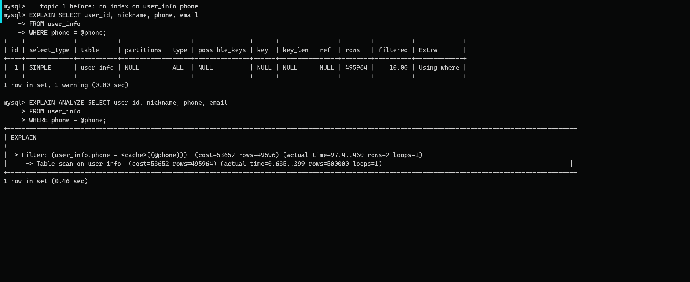

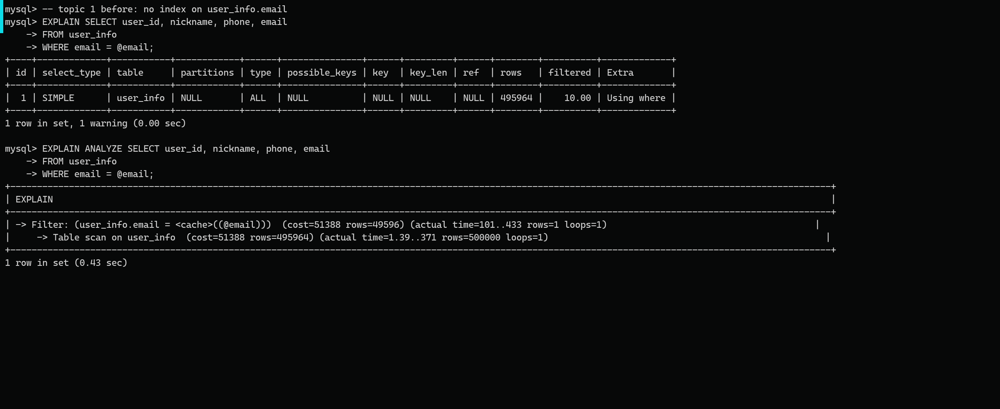

根因：等值查询字段没有索引，MySQL 只能全表扫描后再过滤。

优化方案：

```sql
CREATE INDEX idx_user_info_phone ON user_info(phone);
CREATE INDEX idx_user_info_email ON user_info(email);
```

优化后 `type=ref`，手机号查询命中 `idx_user_info_phone`，邮箱查询命中 `idx_user_info_email`，扫描行数降到 2 行和 1 行。

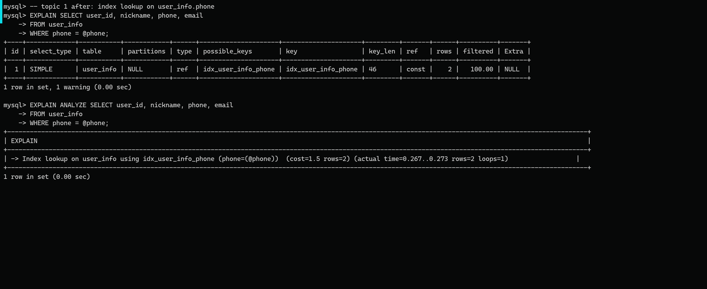

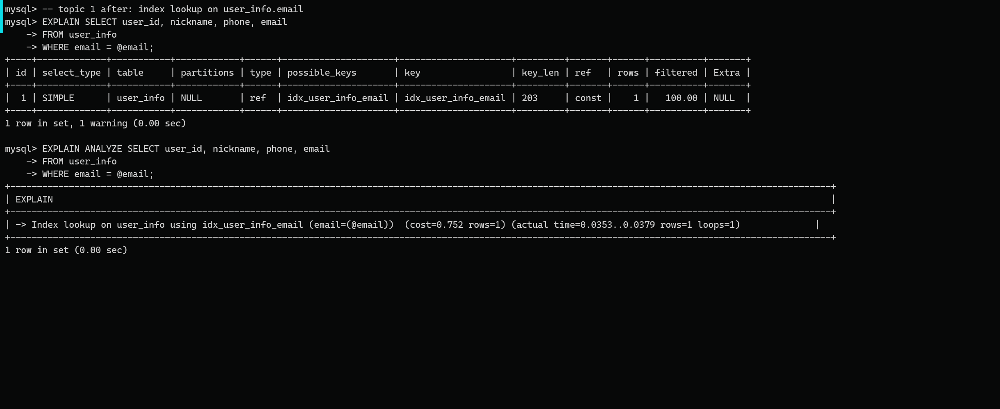

## 三、题目6：函数操作字段导致索引失效

原 SQL：

```sql
SELECT order_id, create_time
FROM order_main
WHERE DATE(create_time) = @day;
```

优化前即使存在 `idx_order_main_create_time`，`DATE(create_time)` 仍会让 MySQL 扫描整段索引，`rows=1,982,843`，实际约 1598 ms。

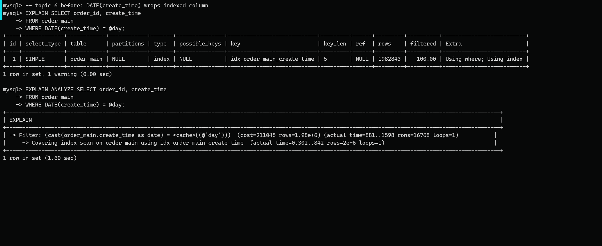

根因：索引按 `create_time` 原值排序，函数包裹字段后无法直接做范围定位。

优化方案：改写为半开区间。

```sql
SELECT order_id, create_time
FROM order_main
WHERE create_time >= @day
  AND create_time < DATE_ADD(@day, INTERVAL 1 DAY);
```

优化后 `type=range`，扫描行数降到 31,910，实际约 16.6 ms。

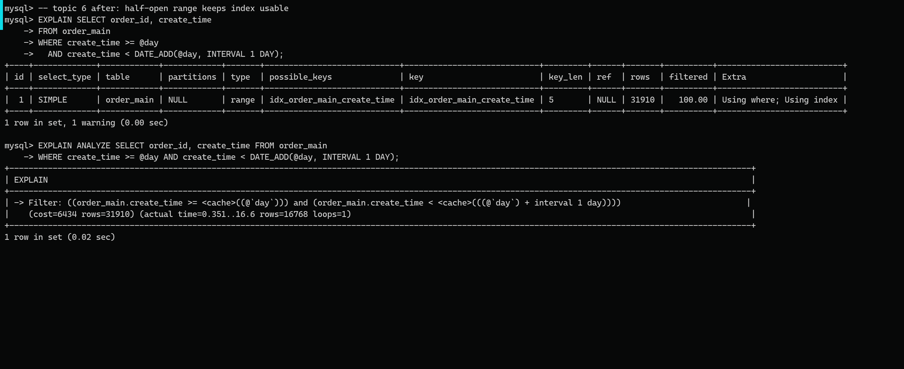

## 四、题目9：杜绝 SELECT *

原 SQL：

```sql
SELECT *
FROM order_main
WHERE order_status = @status
ORDER BY create_time DESC
LIMIT 100;
```

优化前读取整行数据，缺少适合过滤和排序的联合索引，执行计划为 `type=ALL`，`Extra=Using where; Using filesort`，实际约 2517 ms。

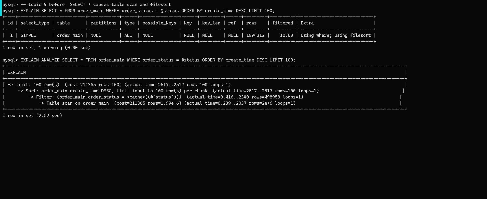

根因：`SELECT *` 增加回表和传输成本，`order_status` 与 `create_time` 没有组成联合索引，排序需要 filesort。

优化方案：

```sql
CREATE INDEX idx_om_status_ct_cover
ON order_main(order_status, create_time, order_id, amount);

SELECT order_id, amount, create_time
FROM order_main
WHERE order_status = @status
ORDER BY create_time DESC
LIMIT 100;
```

优化后命中覆盖索引，`Extra=Backward index scan; Using index`，实际约 1.29 ms。

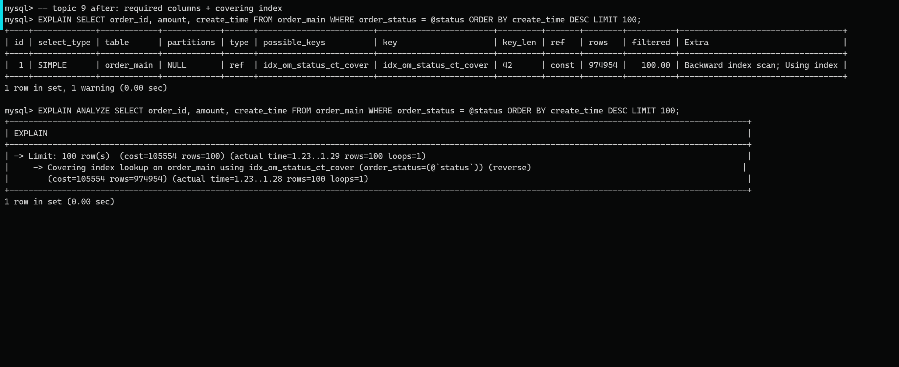

## 五、题目13：Using filesort 文件排序优化

原 SQL：

```sql
SELECT order_id, user_id, amount, create_time
FROM order_main
WHERE user_id = @sample_user_id
ORDER BY create_time DESC
LIMIT 20;
```

优化前只有 `idx_user_id`，可以过滤用户，但排序仍出现 `Using filesort`，实际约 3.68 ms。

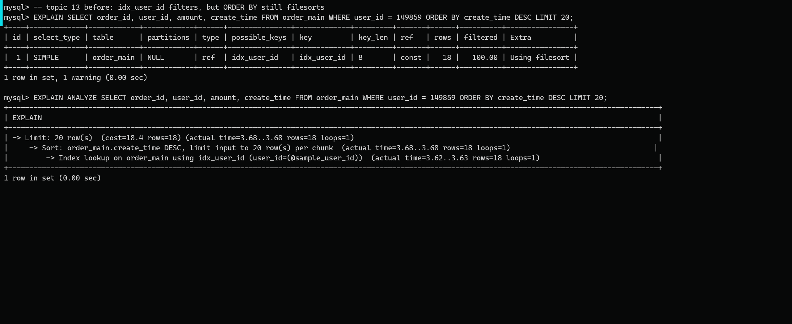

根因：单列索引只保证 `user_id` 有序，不能保证同一用户订单按 `create_time` 有序。

优化方案：

```sql
CREATE INDEX idx_om_user_ct
ON order_main(user_id, create_time, order_id, amount);
```

优化后命中 `idx_om_user_ct`，`Extra=Backward index scan; Using index`，实际约 0.0687 ms。

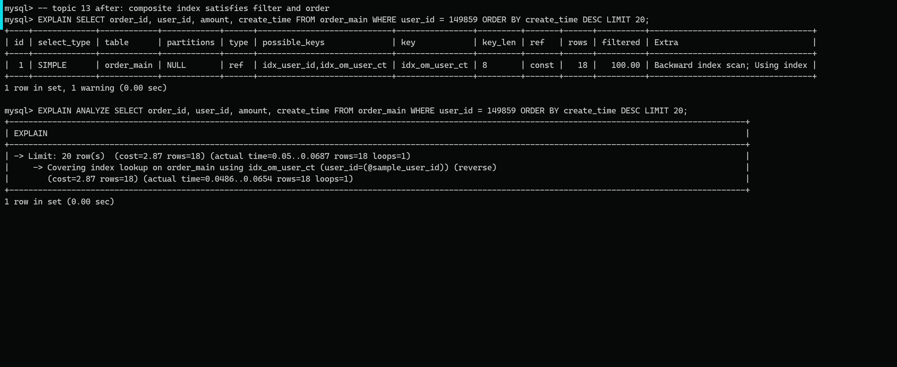

## 六、题目17：批量 DML 语句优化

优化前使用循环单条插入，每插入一行提交一次事务。实验插入 5000 行，耗时 31,095.696 ms。

优化方案：使用 `INSERT ... SELECT` 批量插入，并在一个事务中统一提交。

```sql
INSERT INTO order_insert_demo(user_id, amount, order_status, pay_status, create_time, pay_time, address)
SELECT ...
FROM numbers_1_to_10000
WHERE n <= 5000;
COMMIT;
```

优化后同样插入 5000 行，耗时 168.746 ms，加速约 184.28 倍。

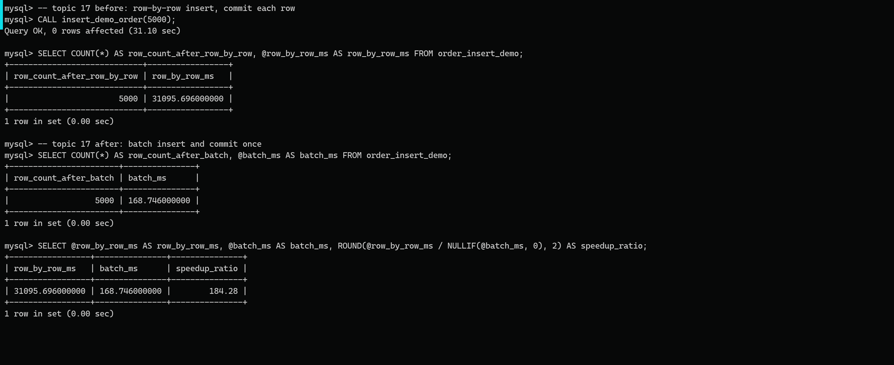

## 七、题目23：大字段冷热分离

原 SQL：

```sql
SELECT *
FROM goods
WHERE category_id = @category_id
ORDER BY create_time DESC
LIMIT 100;
```

优化前商品列表页读取 `goods_detail TEXT` 大字段。虽然可以命中 `idx_goods_category_ct`，但高频列表查询携带冷字段，行宽不合理。

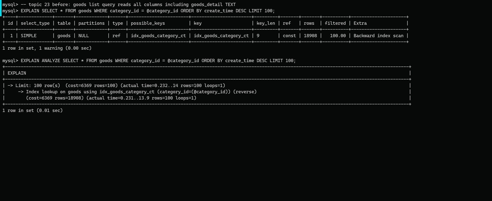

根因：列表页只需要商品名、价格、库存等热字段，详情大文本属于低频字段，不应和高频列表字段混在同一查询路径中。

优化方案：拆分热表和冷表。

```sql
CREATE TABLE goods_hot (...);
CREATE TABLE goods_detail_ext (...);
```

列表页只查 `goods_hot`：

```sql
SELECT goods_id, goods_name, price, stock, category_id, create_time
FROM goods_hot
WHERE category_id = @category_id
ORDER BY create_time DESC
LIMIT 100;
```

详情页需要大字段时再按主键访问冷表：

```sql
SELECT h.goods_id, h.goods_name, h.price, d.goods_detail
FROM goods_hot h
JOIN goods_detail_ext d ON d.goods_id = h.goods_id
WHERE h.goods_id = @sample_goods_id;
```

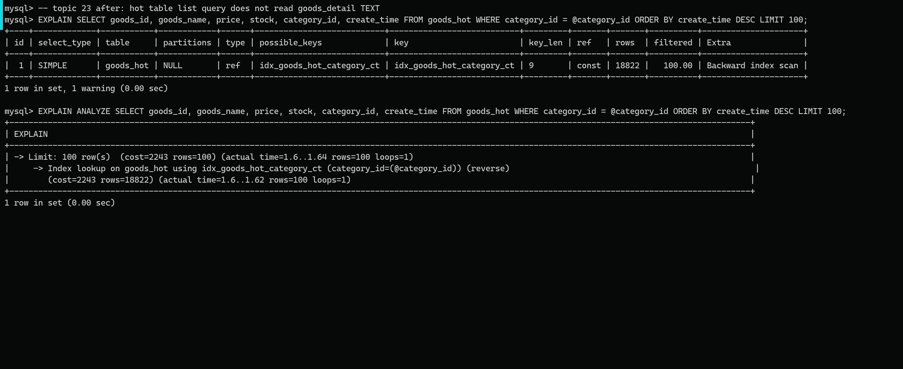

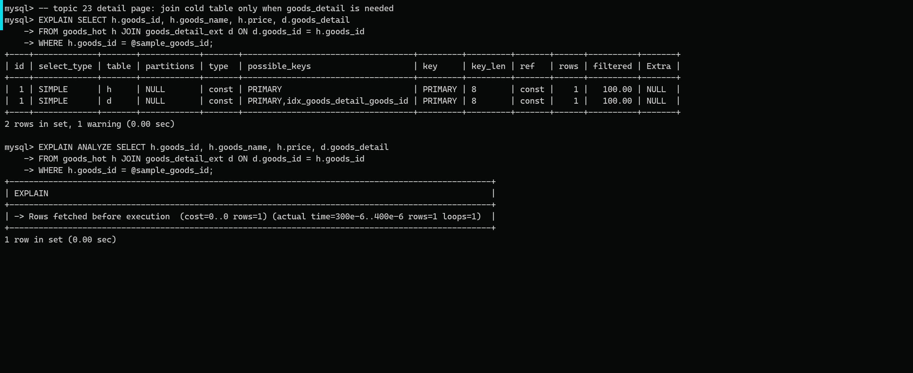

说明：本次实测中 `goods_hot` 是新建副本表，首次访问存在缓存波动，列表查询耗时略高于原表；但结构上已经避免高频列表查询读取 `TEXT` 大字段，详情页访问冷表时两张表均为主键 `const` 访问。

## 八、结果汇总

| 题目 | 模块 | 优化前 | 优化后 |
| --- | --- | --- | --- |
| 题目1 | 索引调优 | `type=ALL`，扫描约 50 万行 | `type=ref`，扫描 1-2 行 |
| 题目6 | 索引调优 | 函数包裹字段，约 1598 ms | 半开区间，约 16.6 ms |
| 题目9 | SQL 调优 | 全表扫描 + filesort，约 2517 ms | 覆盖索引，约 1.29 ms |
| 题目13 | SQL 调优 | `Using filesort`，约 3.68 ms | 联合覆盖索引，约 0.0687 ms |
| 题目17 | 事务调优 | 逐条提交，31,095.696 ms | 批量提交，168.746 ms |
| 题目23 | 模式调优 | 列表查询读取 `TEXT` 大字段 | 热字段与冷字段分离 |

## 九、学习体会

这次实验最大的体会是，数据库调优不能只停留在“加索引”三个字上。比如 `order_main.create_time` 已经建了索引，但 `DATE(create_time)` 这种写法仍然会让 MySQL 扫描大量索引记录；改成半开区间后，访问类型才真正变成 `range`。这说明 SQL 写法会直接决定索引能不能发挥作用。

第二个体会是，执行计划要结合实际业务理解。题目9优化后 `rows` 估算值仍然很大，但因为查询只要 `LIMIT 100`，并且可以沿着覆盖索引倒序读取，实际耗时从秒级降到毫秒级。所以不能只看某一个字段下结论，要把 `type`、`key`、`rows`、`Extra` 和 `EXPLAIN ANALYZE` 放在一起看。

事务优化的效果也比较直观。逐条插入并频繁提交时，主要时间消耗不在单条 SQL 本身，而在大量事务提交、日志刷写和上下文切换上。改成批量写入后，耗时下降非常明显，也让我们理解了为什么实际业务导入数据时要控制批次大小，而不是简单地一条一条提交。

模式调优部分让我们认识到，有些优化不是一次查询立刻变快，而是让表结构更符合业务访问规律。`goods_detail` 这种大字段在列表页并不需要，把热字段和冷字段拆开后，高频查询路径更清晰，详情页再按主键访问冷表，结构上更合理。本次实测中由于缓存和新建副本表的影响，列表查询耗时有波动，这也提醒我们性能测试要多次执行并关注稳定趋势。

总体来看，本次实验让我们把索引、SQL、事务和表结构四类问题串了起来。以后分析慢 SQL 时，应该先用执行计划定位瓶颈，再判断是索引缺失、SQL 写法不合适、事务粒度不合理，还是表结构设计不符合访问场景，而不是直接套用固定优化方法。
