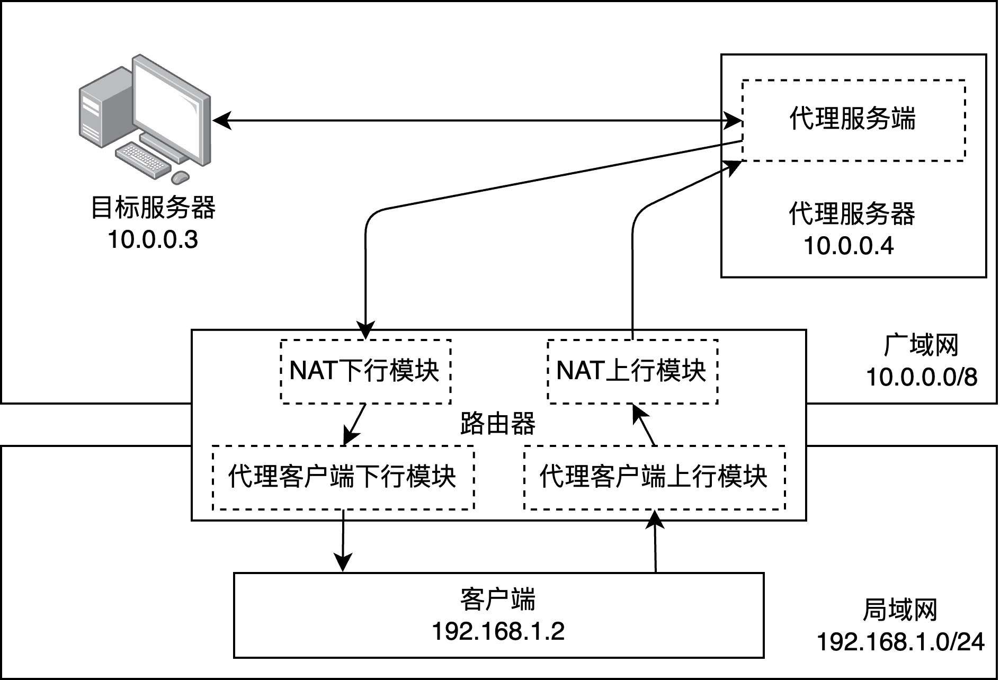

# LAB3 eBPF 实现 NAT 与 代理

经历了许多尝试，最终没有通过一些测试，原因为：
* 文档中一些端口号的说明不明确
* 对 xdp 和 tc 的理解不够深入

但是使用 netns 进行调试，一定程度上增进了对网络协议栈的理解。


### 实际运行的命令
```
sudo ./Lab3_ebpf
```


## 整体流程



位于局域网的客户端向位于广域网的目标服务器发送报文时，会经过如下步骤：

1. 报文首先经过代理客户端，代理客户端根据报文的目的地址和代理规则，判断是否需要将报文送往代理服务端进行代理访问。如果需要，改写报文。
2. 然后，报文会到达路由器，经过NAT协议，发到广域网中。
3. 如果该报文是一个代理客户端改写后送到代理服务器的报文，那么该报文会被代理服务器再次改写，然后转发到原本的目标服务器。
4. 报文到达目标服务器。

位于广域网的服务器向客户端回复报文时，会经过如下步骤：

1. 如果发送时，报文被代理服务器改写过，那么目标服务器会认为代理服务器是“客户端”，因此报文会被首先交给代理服务器处理。
2. 然后，报文会到达路由器，经过NAT协议处理报文。
3. 接着报文会经过路由器上的代理客户端，由代理客户端判断是否是来自代理服务器的报文，如果是，改写报文。
4. 报文被递交给客户端上的应用程序。


## NAT

### 上行模块.
对于来自局域网端口的报文，若下一跳将从广域网端口发出，则需要执行网络地址转换。 即若该报文源地址尚未分配广域网地址，则需要为该源地址分配一个可用广域网地址，并将报文中的源地址替换为对应广域网地址后再发出。 若没有空闲的可用广域网地址，则丢弃该报文。 

该模块将被部署在路由器上，拦截所有通过广域网接口发往广域网的报文。 你需要检查该报文的(源地址,源头端口,传输层协议)是否存在对应的(目标广域网地址,目标广域网端口,传输层协议)的映射。 

如果不存在，则通过随机算法创建一个这样的映射。 然后，根据映射替换报文中的源地址、端口后发出。


### 下行模块. 
对于来自广域网端口的报文，若其目的地址不是该路由器已分配的广域网地址，则直接丢弃。 否则将 **目的地址转换为对应的局域网地址** 后再上交给内核网络协议栈继续处理。

该模块将被部署在路由器上，拦截所有来自广域网的报文。 你需要检查该报文的(目标广域网地址,目标广域网端口,传输层协议)是否存在对应的(源地址,源头端口,传输层协议)。 如果不存在，则不处理。 如果存在，则根据映射替换报文中的目标地址、端口后递交内核网络协议栈继续处理。


## 代理客户端

### 上行模块. 
对于所有从客户端去往路由器的报文，我们可以通过一个报文的目的地址判断该报文是否需要通过代理来发送。 对于需要被代理的报文，我们在他们的IP头前插入一个新的IP头和UDP头，以将该报文转发到代理服务器。

### 下行模块. 
代理服务器在收到目标服务器想要发给客户端的报文时，会转发回客户端。 这些报文在到达客户端时同样经过封装


## 代理服务端

代理服务端包含一个模块，运行在代理服务器上。 代理服务端将局域网的报文伪装成从代理服务器发出。 同时，将来自其他广域网机器的目标为代理服务器的报文，伪装成发往局域网的报文。 代理服务端的工作分为两个部分：监听来自代理客户端的报文，以及转发其他机器的报文。